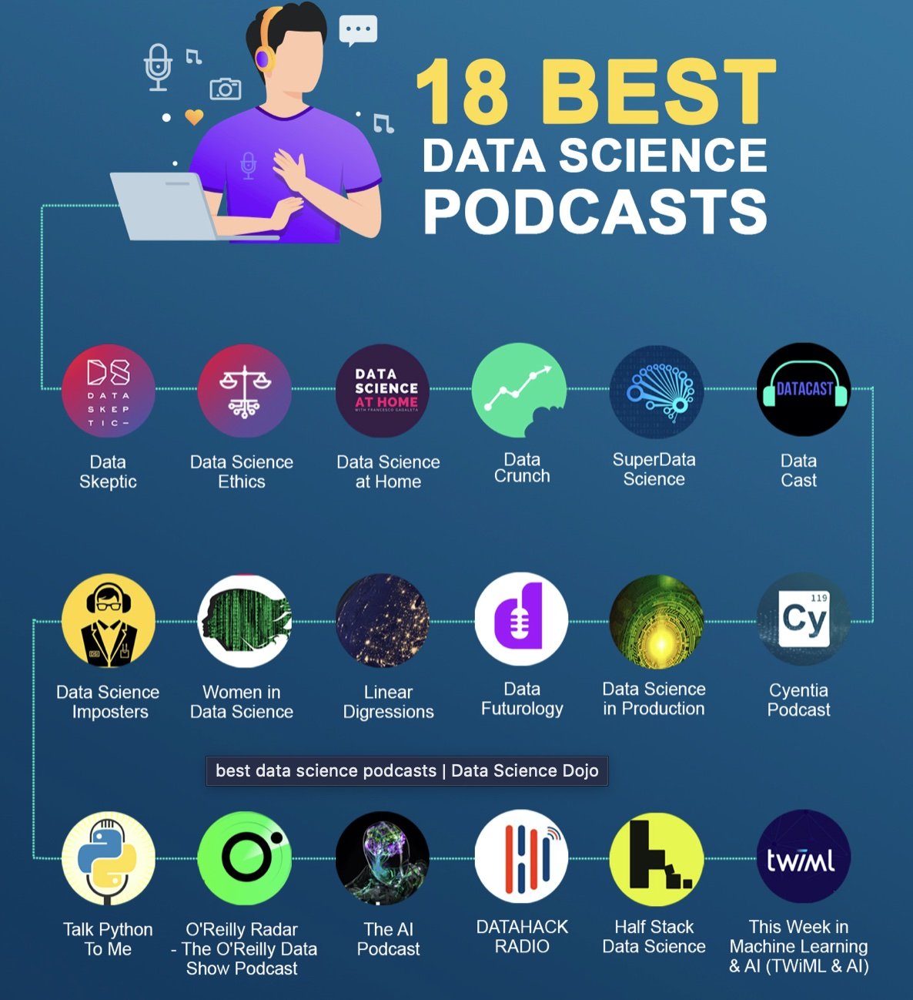
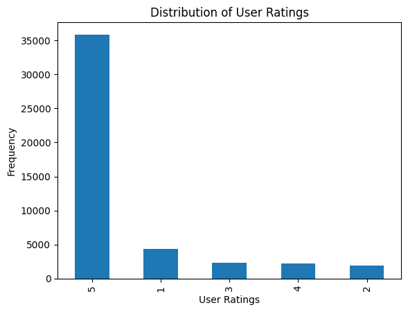
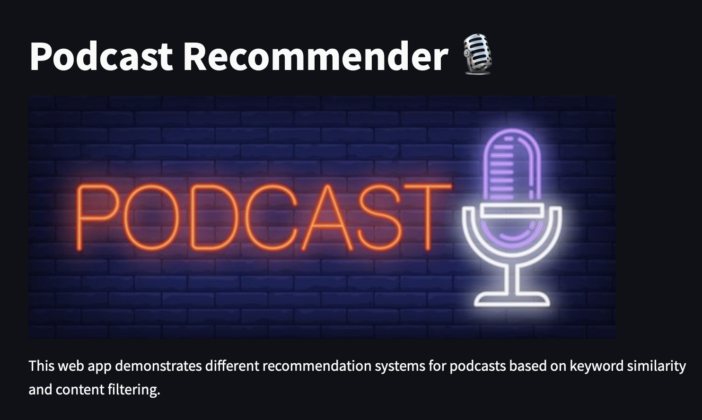

# Recommender System for Podcasts
## Project for AIPI540
## Team members: Shen, Chad, Zenan

>

## Background
Podcasts are a great way to stay informed, become educated on a variety of topics, or enjoy entertaining content. With millions of podcasts in the Apple podcast store, there are an overwheling number of podcasts to choose from, and finding the right content can be challenging. Our project employs three types of models to recommend content: a hybrid system, a content-based filtering system, and a non-ML approach in TF-IDF term seach. 

## Installation instructions

To prepare for the code in the repo, first install the required packages using:

```bash
pip install -r requirements.txt
```

## Dataset
The dataset is comprised of data that we scraped from the itunes podcast website using a method similar to that in https://github.com/siddgood/podcast-recommendation-engine except also scraping user ratings, image url, and and episode description data. In a separate method (in `notebooks/getting_more_podcast_reviews2.ipynb`) we obtained additional user-rating pairs. The data collected was from the group of URLs listing popular podcasts under each genre, with a limited number of user-ratings-reviews. The final dataset is comprised of 46,711 user-rating pairs corresponding to 3,936 unique podcasts, which have a full set of the following data as columns in the dataframe:

- Title: Title of the podcast
- Producer: Producer of the podcast
- Genre: 19 unique genres, including
    -  Leisure
    -  True Crime
    -  Business
    -  Education
    -  Society & Culture
    -  Government
    -  Health & Fitness
    -  Sports
    -  Kids & Family
    -  Science
    -  TV & Film
    -  Comedy
    -  Technology
    -  Fiction
    -  History
    -  Religion & Spirituality
    -  News
    -  Arts
    -  Music
- Description: A text description of the overall podcast information
- Num_episodes: Number of podcast episodes
- Avg_rating: Average rating a on a scale of 1-5
- Num_reviews: Number of ratings contributing to the average rating
- Link: URL for the podcast
- Itunes_id: A unique identifier from the Apple podcast site, used to merge the review information
- Episode Descriptions: Summaries of individual podcast episodes, usually the last 5
- Rating: Rating by an individual user on a scale from 1-5
- User: Username for the reviewer

For the ratings, the data was heavily skewed towards high ratings:

>

Of note, we initially planned to use a large Kaggle dataset consisting of about 75K podcasts and over 5.6 million reviews in two separate json files, but the podcast_id identifiers did not match between the two (only about 30 common ids between the two sets of data), so we could not use this for the hybrid model we initially planned. Instead, we scraped the much smaller dataset ourselves as described above. 

## Non-ML approach: TF-IDF
A non-machine learning approach based on Term Frequency and Inverse Document Frequency (TF-IDF) weighting was performed on the `description` feature of the podcasts. In particular, a vocabulary of the description was first generated by removing common stop words in English. This vocabulary is then fitted to a TF-IDF vectorizer (from Scikit-Learn) to create a TF-IDF weighted document matrix. Keywords of interest are subsequently turned into a vector and being compared to each document in the TF-IDF matrix based on cosine similarity. The most similar results are returned as recommendations. Decent recommendations are observed if keywords of interest are not super rare or archaic. For example, if you entered keywords that did not occur much or at all in the vocabulary of descriptions, the cosine similarity scores are likely to be very low and the results would probably not be of much interest.

To run this model locally, execute the script:
```bash
python scripts/keyword_similarity.py --query <keywords> --k 10
```

## Content-based filtering
We performed content-based filtering on podcast features in the podcast dataset. In particular, we used text embeddings of the `genre`, `description`, and `episode_descriptions` columns to create similarity matrices using cosine similarity. The text from the description and the `episode_descriptions` columns was first processed to exclude url links and special characters and other standard text preprocessing steps such striping white spaces and changing to all lower case. The embeddings were performed using pre-trained sentence transformers model using Siamese-BERT at HuggingFace (model `all-MiniLM-L6-v2`). Different combinations of the features (embedded text from the 3 columns) were investigated and the best results were obtained with the combination of the genre and overall podcast description. Performance is not as high as we would like, with a RMSE of 1.48 for predicting the rating (scale 1-5), possibly due to the small number of podcasts and ratings and the skewed distribution of user ratings.  

## Hybrid model
We implemented a Hybrid Collaborative Filtering model based on the tutorial shared by Jon Reifschneider in his AIPI540 course. The hybrid model made use of features such as `user`, `genre`, `producer`, and `itunes_id` to create feature embeddings as part of a neural network model. The model is trained to predict the rating of a podcast. The Adam optimizer was used and the loss function was MSE. Training was done for 10-15 epochs. Despite comprehensive hyperparameter tuning, validation loss could not go any lower beyond 1.2. In several example runs, we observed a difference as low as 0.7 and as high as 2.5 between predicted rating and true rating. Similar to the predicament faced by the Content-based Filtering approach, this model's  performance may be attributed to the skewed distribution of user ratings where the vast majority of users had only rated 1 podcast and thus not ideal for collaborative filtering. Due to the excessive amount of compute time required for generating predictions across all the podcasts for a user, this model has not been deployed for demonstration.

To run this model locally, execute the script:
```bash
python scripts/hybrid_collaborative_filtering.py --user <username> --k 10 --plot-costs
```

## Deployment
A no-frills web application was deployed using Streamlit to demonstrate the recommendation systems based on TF-IDF and Content Filtering. To deploy the Streamlit application:

1. Install required packages:
```bash
pip install -r app/requirements.txt
```

2. Launch Streamlit process:
```bash
streamlit run app/Home.py
```

## Demo
Screenshot of the demo app homepage:

The demo app is hosted on Streamlit Cloud. [](https://podcast-recommender.streamlit.app) to try out the podcast recommender.

## Repository Structure
```
|____app
| |____Home.py
| |____requirements.txt
| |____assets
| | |____podcast_neon_banner.jpeg
| |____pages
| | |____Content_Filtering.py
| | |____Keyword_Similarity.py
|____requirements.txt
|____README.md
|____.gitignore
|____scripts
| |____hybrid_collaborative_filtering.py
| |____config.py
| |____clean_dataframe_text.py
| |____content_based_filtering.py
| |____create_text_embeddings.py
| |____test.py
| |____keyword_similarity.py
|____data
| |____podcast_df_tokens_040723.pkl
| |____archive
| | |____cmm_scraped_podcasts_with_ratings.pkl
| | |____cleaned_podcast2.pkl
| | |____cmm_scraped2.pkl
| | |____another_ratings.pkl
| | |____firstscrape_ratings.pkl
| |____podcast_df_040423.pkl
| |____cleaned_df.pkl
| |____podcast_embeddings_only.pkl
| |____podcast_base_with_embeds.pkl
|____assets
| |____user_ratings_podcasts.png
| |____bestdspods.jpg
| |____best-data-science-podcasts.jpeg
| |____demo_home.png
| |____data_skeptic_logo.jpeg
| |____itunes_podcast.png
| |____duke360.jpeg
|____notebooks
| |____Rescrape_using_siddgood_code.ipynb
| |____Clean_dataframe_text.ipynb
| |____getting_more_podcast_reviews2.ipynb
| |____get_images.ipynb
| |____tfidf.ipynb
| |____Get_text_embeddings_and_content_filtering.ipynb
| |____hybrid_collaborative_filtering.ipynb
| |____archived
    |____exploringdata.ipynb
    |____getting_more_podcast_reviews.ipynb
    |____load_and_compare_datasets.ipynb
    |____Get_text_embeddings.ipynb
```